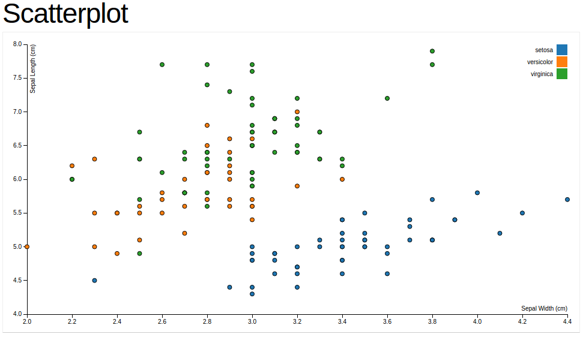

```{r}
library(stringr)
library(dplyr)
library(lubridate)
library(ggplot2)
library(GGally)
```

Perguntas criadas:

1. Quanto menor o tempo que o usuário passou no formulário, mais aleatório ele acha que foi? E qual a região do teclado mais utilizada por essa pessoa?

2. Qual a distância média dos caracteres da variável "agora uma digitação aleatória usando todo o teclado"?

3. Qual a região do teclado mais utilizado?

```{r}
data <- read.csv("pessoas-aleatorias-digitando-coisas-aleatorias-report.csv")
```

Vamos selecionar a pergunta 1ª para responder.

Primeiro vamos ver quais as ocorrências de cada letra do alfabeto:

```{r}
data.letters.occurence <- data
data.letters.occurence <- data.letters.occurence %>%
  mutate(all.letters = paste0(agora.uma.digitação.aleatória.usando.todo.o.teclado, e.uma.última..por.favor))

data.letters.occurence$a <- str_count(data.letters.occurence$all.letters, "a")
data.letters.occurence$b <- str_count(data.letters.occurence$all.letters, "b")
data.letters.occurence$c <- str_count(data.letters.occurence$all.letters, "c")
data.letters.occurence$d <- str_count(data.letters.occurence$all.letters, "d")
data.letters.occurence$e <- str_count(data.letters.occurence$all.letters, "e")
data.letters.occurence$f <- str_count(data.letters.occurence$all.letters, "f")
data.letters.occurence$g <- str_count(data.letters.occurence$all.letters, "g")
data.letters.occurence$h <- str_count(data.letters.occurence$all.letters, "h")
data.letters.occurence$i <- str_count(data.letters.occurence$all.letters, "i")
data.letters.occurence$j <- str_count(data.letters.occurence$all.letters, "j")
data.letters.occurence$k <- str_count(data.letters.occurence$all.letters, "k")
data.letters.occurence$l <- str_count(data.letters.occurence$all.letters, "l")
data.letters.occurence$m <- str_count(data.letters.occurence$all.letters, "m")
data.letters.occurence$n <- str_count(data.letters.occurence$all.letters, "n")
data.letters.occurence$o <- str_count(data.letters.occurence$all.letters, "o")
data.letters.occurence$p <- str_count(data.letters.occurence$all.letters, "p")
data.letters.occurence$q <- str_count(data.letters.occurence$all.letters, "q")
data.letters.occurence$r <- str_count(data.letters.occurence$all.letters, "r")
data.letters.occurence$s <- str_count(data.letters.occurence$all.letters, "s")
data.letters.occurence$t <- str_count(data.letters.occurence$all.letters, "t")
data.letters.occurence$u <- str_count(data.letters.occurence$all.letters, "u")
data.letters.occurence$v <- str_count(data.letters.occurence$all.letters, "v")
data.letters.occurence$w <- str_count(data.letters.occurence$all.letters, "w")
data.letters.occurence$x <- str_count(data.letters.occurence$all.letters, "x")
data.letters.occurence$y <- str_count(data.letters.occurence$all.letters, "y")
data.letters.occurence$z <- str_count(data.letters.occurence$all.letters, "z")

```

Vamos calcular agora o tempo que a pessoa passou no formulário:

```{r}
data.letters.occurence <- data.letters.occurence %>%
  mutate(
    diferenca.tempo = as.numeric(difftime(ymd_hms(data.letters.occurence$Submit.Date..UTC.), ymd_hms(data.letters.occurence$Start.Date..UTC.)))
    )

summary(data.letters.occurence$diferenca.tempo)
```

A mediana de tempo de resposta foi de cerca de 2,5 minutos.

Agora vamos ver quanto cada região do teclado foi utilizada:

```{r}
data.letters.occurence <- data.letters.occurence %>%
  mutate(
    regiao1 = q+a+z+x+s+w,
    regiao2 = e+d+c+v+f+r,
    regiao3 = t+g+b+n+h+y,
    regiao4 = u+j+m+k+i+o+l+p
  )
```

Agora vamos calcular o desvio padrão das regiões de cada usuário:

```{r}
data.letters.occurence$sd.regioes <- apply(
    select(data.letters.occurence, regiao1, regiao2, regiao3, regiao4), 
    1, 
    sd, 
    na.rm = TRUE
  )
```

Agora vamos responder a pergunta:

- Quanto menor o tempo que o usuário passou no formulário, mais aleatório ele acha que foi? E qual a região do teclado mais utilizada por essa pessoa?

```{r}
ggplot(data.letters.occurence, aes(x = diferenca.tempo, y = quão.aleatório.você.acha.que.foi.)) +
  geom_point(aes(colour = sd.regioes))
```

Para fins de visualização, vamos remover os que levaram mais de 500 segundos para responder o formulário:

```{r}
data.letters.occurence.filtered <- data.letters.occurence %>%
  filter(diferenca.tempo < 500)

ggplot(data.letters.occurence.filtered, aes(x = diferenca.tempo, y = quão.aleatório.você.acha.que.foi.)) +
  geom_point(aes(colour = sd.regioes))
```

Como ficou difícil ver as diferenças de cores, vamos fazer um espalhamento dos pontos, para ter uma maior visibilidade:

```{r}
ggplot(data.letters.occurence.filtered, aes(x = diferenca.tempo, y = quão.aleatório.você.acha.que.foi.)) +
  geom_point(aes(colour = sd.regioes)) +
  geom_jitter()
```

Não parece existir uma tendência entre as variáveis "quão aleatório você acha que foi", "tempo que o usuário levou para preencher o formulário" e "desvio padrão das regiões do teclado".

Podemos verificar isso com as correlações:

```{r}
cor(data.letters.occurence$quão.aleatório.você.acha.que.foi., data.letters.occurence$diferenca.tempo)
cor(data.letters.occurence$quão.aleatório.você.acha.que.foi., data.letters.occurence$sd.regioes)
cor(data.letters.occurence$diferenca.tempo, data.letters.occurence$sd.regioes)
```

Onde nenhuma combinação tem uma correlação significativa.

Apenas a nível de curiosidade, vamos ver se existe alguma relação entre as variáveis:

```{r}
ggpairs(select(data.letters.occurence, um.esquente..digite.um.número.de.0.a.9, quão.aleatório.você.acha.que.foi., quão.aleatório.você.acha.que.você.é., diferenca.tempo, regiao1, regiao2, regiao3, regiao4, sd.regioes))
```

Podemos verificar que existe uma alta correlação entre a região 4 do teclado e o desvio padrão das regiões, ou seja, quanto mais a pessoa digita nesta região, mais variação entre as regiões do teclado ela produziu, o que é um pouco surpreendente.

A visualização que será feita no d3, será parecida com esta:



Que pode ser encontrada neste [link](http://bl.ocks.org/mbostock/3887118)


